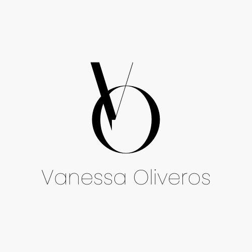

<a name="readme-top"></a>

<div align="center">
  
  <br/>
</div>

<details>
<summary> 📗 Table of Contents</summary>

- [📖 About the Project](#about-project)
  - [🛠 Built With](#built-with)
    - [Tech Stack](#tech-stack)
    - [Key Features](#key-features)
  - [🚀 Link to Live Demo](#live)
- [💻 Getting Started](#getting-started)
  - [Setup](#setup)
  - [Prerequisites](#prerequisites)
  - [Install](#install)
  - [Usage](#usage)
- [👤 Author](#author)
- [🔭 Future Features](#future-features)
- [🤝 Contributing](#contributing)
- [⭐️ Show your support](#support)
- [🙏 Acknowledgements](#acknowledgements)
- [📝 License](#license)
</details>

# 👩‍💻 Vanessa's portfolio <a name="about-project"></a>

Welcome to my Full-stack Portfolio! I'm Vanessa, a dedicated Full-stack developer, and this is my showcase of projects. I've designed this portfolio to showcase my proficiency in Front-end and Back-end development

## 🛠 Built With <a name="built-with"></a>

### Tech Stack <a name="tech-stack"></a>

<details>
  <summary>Client</summary>
  <ul>
    <li>Library: <a href="https://react.dev/">React</a></li>
    <li>State management: <a href="https://redux.js.org/">Redux</a></li>
    <li>Styling: CSS</li>
  </ul>
</details>

<details>
  <summary>Utils</summary>
  <ul>
    <li>Testing Framework: <a href="https://jestjs.io/">Jest</a></li>
    <li>Package Manager: Node Package Manager(npm)</li>
  </ul>
</details>

### Key Features <a name="key-features"></a>

- Developed with React and Vite for rapid development.
- Utilizes Redux for state management in the application.
- Styled with CSS for a clean and elegant design.
- Showcases a variety of projects I've worked on, covering both frontend and backend development.
- Provides detailed information about my background and professional experience as a full-stack developer.

<p align="right">(<a href="#readme-top">back to top</a>)</p>

## 🚀 Live Demo<a name="live"></a>

- Check out My Portfolio [here.](https://vanessa-oliveros-portfolio.netlify.app/)

<p align="right">(<a href="#readme-top">back to top</a>)</p>

## 💻 Getting Started <a name="getting-started"></a>

To get a local copy up and running, follow these steps.

### Prerequisites

Before you begin, make sure you have the following prerequisites:
- A modern web browser such as Google Chrome or Mozilla Firefox.
- An internet connection.
- The latest version of My Portfolio project.

### Setup

Clone or download My Portfolio repository to your local machine.
```sh
  git clone https://github.com/vvoo21/my-portfolio.git
```
Open your terminal and navigate to the cloned project directory.
```sh
  cd my-portfolio
```

### Install

Install the project dependencies by running the command:
```sh
npm install
```

### Usage
Run the following command to build the project:
```sh
npm run build
```

Start the localhost server to run the application locally.
```sh
  npm run dev
```
Open your web browser and go to `http://localhost:5173` and the application will be running.

## 👤 Author <a name="author"></a>

👤 **Vanessa Oliveros Padron**

- GitHub: [@vvoo21](https://github.com/vvoo21)
- Twitter: [@vaneoliverosp](https://twitter.com/vaneoliverosp)
- LinkedIn: [vaneoliverosp](https://www.linkedin.com/in/vaneoliverosp/)

<p align="right">(<a href="#readme-top">back to top</a>)</p>

## 🔭 Future Features <a name="future-features"></a>

- 🎨 Improved design and user experience enhancements.
- 📝 Blog section to share insights and experiences.

Stay tuned for these exciting updates as I continue to evolve and improve my portfolio!

<p align="right">(<a href="#readme-top">back to top</a>)</p>

## 🤝 Contributing <a name="contributing"></a>

Contributions are welcome! If you'd like to contribute to this project, please [open an issue](https://github.com/vvoo21/my-portfolio/issues).

<p align="right">(<a href="#readme-top">back to top</a>)</p>

## ⭐️ Show your support <a name="support"></a>

If you like this project please give it a star ⭐️. Thanks for your support!

<p align="right">(<a href="#readme-top">back to top</a>)</p>

## 🙏 Acknowledgments <a name="acknowledgements"></a>
- Special thank to [Dina Iakovenko](https://www.behance.net/gallery/162243505/Portfolio-website-forfront-end-developer?tracking_source=search_projects|developer+portfolio) for providing the design guidelines.

<p align="right">(<a href="#readme-top">back to top</a>)</p>

## 📝 License <a name="license"></a>

This project is [MIT](./LICENSE) licensed.

<p align="right">(<a href="#readme-top">back to top</a>)</p>
